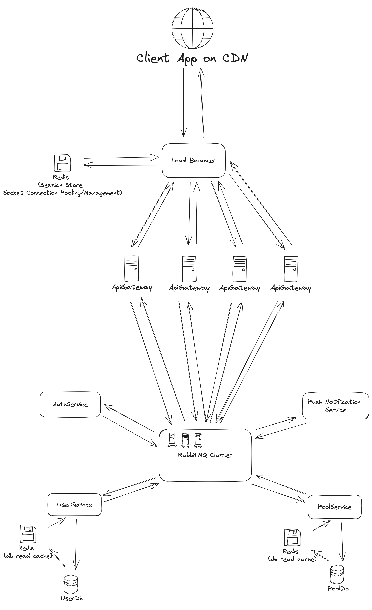

## Investment Pool Management System Architecture

### Overview

The Investment Pool Management System is designed to allow fund managers to create and manage investment pools with a focus on scalability, reliability, and security.

### Components

1. **User Interface (Web/Mobile)**:

   - Fund managers and investors interact with the system through web and mobile interfaces.

2. **Load Balancer**:

   - Incoming requests are distributed among multiple application servers for load balancing.

3. **Application Layer (Golang)**:

   - Golang handles core business logic and real-time updates.

4. **Application Servers**:

   - Multiple Golang application servers process user requests and manage investment pools.

5. **Database (CockroachDB)**:

   - CockroachDB, a distributed SQL database, ensures scalability, reliability, and data consistency.

6. **Message Broker (RabbitMQ)**:

   - RabbitMQ provides various delivery guarantees, including at-most-once, at-least-once, and exactly-once semantics. You can configure it for the desired level of reliability..

7. **Caching Layer (Redis)**:

   - Redis caches frequently accessed data, reducing database load and improving response times.

8. **Security Layer**:
   - Manages user authentication, data encryption, and access control.
   - Utilizes OAuth2 and JWT for secure user authentication.
   - Implements HTTPS for data security in transit.

### Technologies and Tools

- **Golang**: Efficient, concurrent, and real-time processing capabilities.
- **CockroachDB**: Distributed SQL database for reliable and scalable data storage.
- **RabbitMQ**: High-performance message broker for real-time updates and notifications.
- **Redis**: Caching layer for faster data retrieval and reduced database load.
- **OAuth2 and JWT**: Secure user authentication and authorization.
- **HTTPS**: Ensures data security in transit.
- **Docker and Kubernetes**: Containerization and orchestration for scalability and deployment flexibility.

### Scalability and Reliability

- **Database Scalability**: CockroachDB's distributed architecture allows horizontal scaling to accommodate a growing number of users and transactions.
- **Load Balancing**: Distributes incoming requests among multiple application servers for high availability.
- **Message Queue**: RabbitMQ handles real-time updates and ensures reliable message delivery.

### Security

- **Encryption**: Utilizes HTTPS to encrypt data in transit and employs encryption mechanisms for sensitive data storage.
- **Access Controls**: Implements role-based access controls to restrict access to sensitive financial information.
- **User Authentication**: OAuth2 and JWT provide secure user authentication and authorization.

### Challenges and Solutions

- **Concurrency**: Utilizes Golang's concurrency features to handle real-time updates efficiently and minimize bottlenecks.
- **Data Consistency**: Implements database transactions and messaging patterns to ensure data consistency, even in a distributed database.

### Database Selection Rationale

CockroachDB was chosen due to its horizontal scalability, strong consistency, and high availability, making it well-suited for financial applications with the need for data accuracy and reliability.

### Message Broker Selection Rationale

RabbitMQ was selected for its high performance and reliability, ensuring consistent delivery of real-time updates and notifications.
